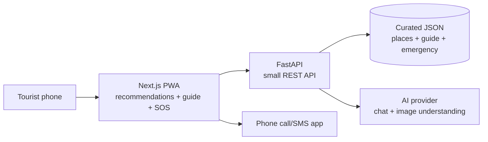
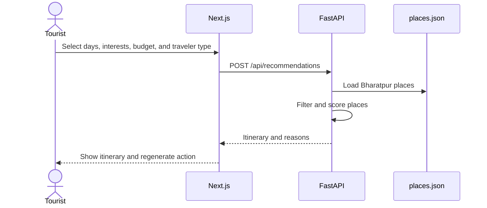
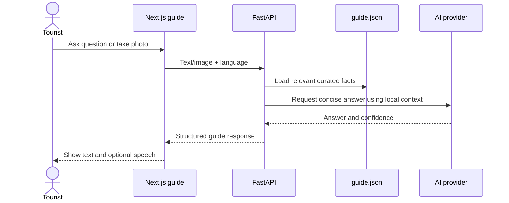

# YatraAI — Hackathon Prototype Architecture

## 1. Prototype goal

YatraAI helps a tourist discover Bharatpur, understand what they are seeing, and get help during an emergency.

The prototype contains exactly three product flows:

1. **Recommendation:** create a simple personalized Bharatpur itinerary.
2. **Virtual guide:** answer a question or explain a photo of a supported place or object.
3. **SOS:** show emergency information and start call or SMS actions, even when the internet is unavailable.

The architecture is deliberately small. It is designed to produce a reliable demo before adding accounts, dashboards, live monitoring, or large-scale data systems.

## 2. Technology decision

| Part | Prototype choice | Responsibility |
|---|---|---|
| Web app | Next.js | Screens, camera, browser speech, offline SOS screen |
| API | FastAPI | Recommendation logic, guide requests, optional SOS sync |
| Data | JSON files | Curated Bharatpur places, guide facts, emergency information |
| AI | One vision/chat provider | Image understanding and conversational answers |
| Offline storage | Service worker + localStorage | Cached SOS screen, contacts, and queued events |

There is no authentication, Supabase, PostgreSQL, Redis, map server, weather server, or separate microservice in the first version. A small SQLite database can replace JSON later without changing the feature boundaries.

## 3. High-level architecture



The browser never receives the AI API key. The key stays in FastAPI environment variables.

## 4. Responsibilities

### Next.js

- Render the home screen and the three feature screens.
- Collect recommendation preferences.
- Capture a camera image and send it to FastAPI.
- Send text questions to FastAPI.
- Use browser text-to-speech when available.
- Cache the SOS route and emergency data.
- Open `tel:` and `sms:` actions from the SOS screen.

### FastAPI

- Validate incoming request data.
- Filter and score places for recommendations.
- Load the small local guide context.
- Call the AI provider for guide chat and image analysis.
- Return predictable JSON responses.
- Accept SOS events when connectivity returns.

### Local data

Keep the first dataset small and verified by the team:

```text
backend/data/
  places.json       # 15–25 Bharatpur places
  guide.json        # short facts for supported landmarks and objects
  emergency.json    # emergency numbers, hospitals, police, and instructions
```

## 5. Recommendation flow

The recommendation system is rule-based. It does not need machine learning for the demo.



Required inputs:

```json
{
  "days": 2,
  "budget": "medium",
  "interests": ["culture", "nature"],
  "traveler_type": "family",
  "language": "en"
}
```

Use a transparent score:

```text
score = interest_match
      + budget_match
      + traveler_match
      + safety_score
      - repeated_category_penalty
```

`Safety score` is a static field maintained by the team. It is not a live safety engine.

Example place record:

```json
{
  "id": "bharatpur-museum",
  "name": "Bharatpur Museum",
  "categories": ["culture", "history"],
  "budget": "low",
  "good_for": ["family", "solo"],
  "safety_score": 5,
  "duration_minutes": 90,
  "summary": "A place to learn about the history and culture of Bharatpur."
}
```

The API should select real places first. If the team later uses AI to explain the itinerary, the model only rewrites the selected places; it must not invent new destinations.

## 6. Virtual guide flow

The guide has two entry points:

- **Ask:** type or speak a question.
- **See:** take a photo and receive a short explanation.



For the first demo, support a small set of known Bharatpur landmarks, cultural objects, local food, and wildlife. When confidence is low, return a clear message such as “I could not identify this confidently.”

Guide response:

```json
{
  "title": "Bharatpur Museum",
  "summary": "A short explanation in the selected language.",
  "confidence": "high",
  "suggested_questions": [
    "What should I see here?",
    "What can I visit nearby?"
  ]
}
```

Text input and text output are required. Browser speech recognition and text-to-speech are optional enhancements because browser support can vary.

## 7. Offline SOS flow

SOS must open without waiting for FastAPI. During normal use, the app caches the SOS screen and emergency pack.


Prototype behavior:

- Keep the SOS button on the home screen.
- Cache the SOS route and emergency pack with a service worker.
- Store user emergency contacts in `localStorage` or `IndexedDB`.
- Use `navigator.geolocation` when the device permits it.
- Use `tel:` to start a call and `sms:` to prepare a message.
- Store a local event even if `/api/sos/sync` cannot be reached.

A browser cannot silently place a call or send an SMS. The phone’s call or messaging app must be confirmed by the tourist. Cellular calls and SMS may still work when mobile internet does not. If there is no network of any kind, the app can still show cached instructions and the last available location.

## 8. Minimal API

```text
GET  /api/health
POST /api/recommendations
POST /api/guide/chat
POST /api/guide/analyze-image
POST /api/sos/sync
```

The SOS endpoint is best-effort telemetry. The actual emergency actions must work without it.

### Recommendation response

```json
{
  "days": [
    {
      "day": 1,
      "places": [
        {
          "id": "bharatpur-museum",
          "name": "Bharatpur Museum",
          "reason": "Matches your culture interest and family group."
        }
      ]
    }
  ]
}
```

### Guide requests

`/api/guide/chat` accepts text and language.

`/api/guide/analyze-image` accepts a compressed image, optional question, and language.

Both return the same guide response shape so the frontend has one display component.

## 9. Minimal folder structure

```text
yatraai/
  app/
    page.tsx                 # home and feature links
    discover/page.tsx        # recommendations
    guide/page.tsx           # camera and chat
    sos/page.tsx             # offline SOS
    settings/page.tsx        # language and contacts
  components/
    PlaceCard.tsx
    GuideAnswer.tsx
    EmergencyActions.tsx
  lib/
    api.ts
    offline.ts
  public/
    emergency-pack.json
    sw.js
  backend/
    main.py
    data/
      places.json
      guide.json
      emergency.json
    routes/
      recommendations.py
      guide.py
      sos.py
```

The current repository is still a starter Next.js app, so the `backend/` directory and feature routes will be added during implementation.

## 10. Build order

### Step 1 — Frontend shell

- Replace the starter page with a mobile home screen.
- Add Discover, Virtual Guide, and SOS cards.
- Add language selection and a visible SOS action.

### Step 2 — Recommendation vertical slice

- Add `places.json` with 15–25 Bharatpur places.
- Add the FastAPI recommendation endpoint.
- Implement filtering, scoring, and an itinerary response.
- Display the itinerary in Next.js.

### Step 3 — Guide vertical slice

- Add text chat first.
- Add `guide.json` and a small AI prompt.
- Add image analysis for a few known places.
- Add browser speech only if stable on the demo device.

### Step 4 — SOS vertical slice

- Add cached emergency data and the SOS route.
- Add contacts, location, call, and SMS actions.
- Test with airplane mode enabled.

### Step 5 — Demo polish

- Add loading and error states.
- Add an offline indicator.
- Add confidence and fallback messages for the guide.
- Prepare one scripted demo for each feature.

## 11. Demo acceptance criteria

The prototype is ready when:

1. A tourist selects preferences and receives a Bharatpur itinerary using real seeded places.
2. A tourist asks a question or scans a supported place and receives a concise answer in English, Nepali, or Hindi.
3. A tourist enables airplane mode, opens SOS, sees cached emergency information, and can start a call or prepared SMS.

## 12. Explicitly postponed

These are future improvements, not prototype requirements:

- Supabase and user authentication.
- Tourist, guide, and admin roles.
- Guide verification and trip assignment.
- Live location monitoring.
- Risk-zone alerts and timed check-ins.
- Weather, crowd, and route APIs.
- Maps and route optimization.
- Feedback learning and analytics dashboards.
- Microservices, Redis, vector databases, and model fine-tuning.
