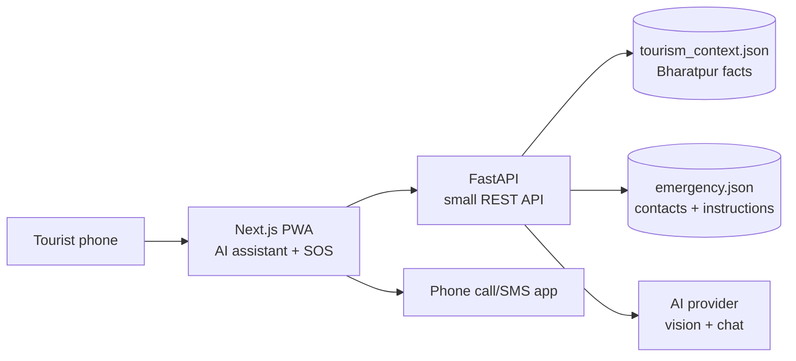
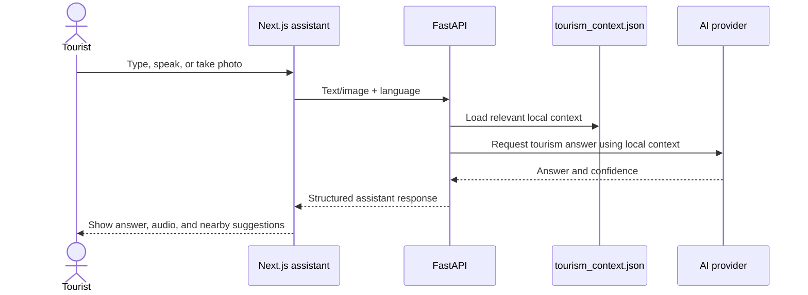
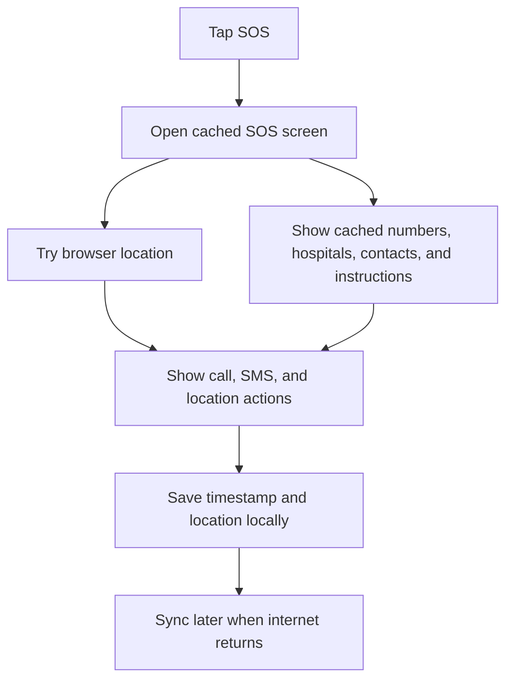

# YatraAI — Two-Feature Hackathon Architecture

## 1. Product focus

YatraAI is a tourist companion for Bharatpur with two connected capabilities:

1. **AI tourism assistant:** answer tourist questions about places, objects, culture, food, history, travel tips, and safety through camera, text, and voice.
2. **Emergency mode:** help tourists reach emergency services and view safety information even when internet access is unavailable.

The itinerary recommendation feature is intentionally removed from the prototype. A small “nearby places” suggestion can appear after a guide answer, but it is only curated data, not a separate recommendation system.

The winning product story is simple:

> **Ask YatraAI anything about your trip, show it what you see, and get help when you need it.**

## 2. Technology decision

| Part | Prototype choice | Responsibility |
|---|---|---|
| Web app | Next.js PWA | Camera, voice, chat, language, cached SOS interface |
| API | FastAPI | AI assistant requests, curated context, optional SOS sync |
| Local data | JSON files | Bharatpur facts and emergency information |
| AI | One multimodal provider | Tourism answers, image understanding, and multilingual responses |
| Offline storage | Service worker + IndexedDB | Cached SOS screen, contacts, and local events |

Do not add authentication, Supabase, PostgreSQL, Redis, maps, weather, crowd prediction, live trip tracking, or microservices during the prototype phase.

## 3. High-level architecture



The browser never receives the AI API key. The key stays in FastAPI environment variables.

## 4. Responsibilities

### Next.js

- Render the home, AI assistant, SOS, and settings screens.
- Capture images from the phone camera.
- Send text and image questions to FastAPI.
- Display multilingual assistant answers and confidence states.
- Use browser text-to-speech where supported.
- Cache the SOS route and emergency pack.
- Store emergency contacts and SOS events locally.
- Open `tel:` and `sms:` actions.

### FastAPI

- Validate assistant requests.
- Load the small curated Bharatpur context.
- Call the AI provider for chat and image understanding.
- Return one predictable assistant response shape.
- Return a safe fallback if the provider fails or confidence is low.
- Provide the emergency pack online when available.
- Accept locally queued SOS events when connectivity returns.

### Local data

```text
backend/data/
  tourism_context.json # Bharatpur facts, tourism topics, nearby suggestions
  emergency.json    # emergency numbers, hospitals, police, instructions
```

The team should verify every fact used in the demo and include its source in the data file.

## 5. AI tourism assistant architecture

The assistant has three input modes:

- **Text:** type any tourism-related question.
- **Voice:** speak a question and hear the answer.
- **Vision:** take a photo and ask what the camera is showing.



The assistant can answer broad tourism questions using the AI model, while Bharatpur-specific facts should come from the curated context. It should not invent locations, historical dates, emergency numbers, prices, or opening hours. For current information that the prototype cannot verify, it should say that the information may have changed.

### Tourism context data

Start with 5–8 highly polished local examples and common tourism topics instead of trying to cover all of Bharatpur:

- One or two cultural landmarks.
- One museum or historical place.
- One local food or craft example.
- One wildlife or nature example.
- One common tourist question category.

Each record can contain:

```json
{
  "id": "bharatpur-museum",
  "names": {
    "en": "Bharatpur Museum",
    "ne": "भरतपुर संग्रहालय",
    "hi": "भरतपुर संग्रहालय"
  },
  "keywords": ["museum", "history", "bharatpur"],
  "facts": [
    "Verified local fact one.",
    "Verified local fact two."
  ],
  "nearby": ["nearby-place-id"],
  "safety_tip": "Stay with your group and follow local instructions.",
  "source": "Team verified municipal or tourism source"
}
```

### Assistant response

Both text and image requests return the same shape:

```json
{
  "title": "Bharatpur Museum",
  "summary": "A short answer in the selected language.",
  "confidence": "high",
  "nearby": [
    {
      "id": "nearby-place-id",
      "name": "Nearby place",
      "reason": "Why it is relevant"
    }
  ],
  "suggested_questions": [
    "What should I look at here?",
    "What can I visit nearby?"
  ]
}
```

When vision confidence is low, return a clear response such as “I could not identify this confidently. Try a clearer photo or ask me a question.”

Text input and text output are required. Browser speech recognition and text-to-speech are the first voice implementation. A server speech provider can be added only if browser speech is unreliable on the presentation device.

## 6. Offline SOS architecture

SOS must open without waiting for FastAPI. During normal use, the app caches the SOS route and emergency pack.



Prototype behavior:

- Keep SOS visible from the home screen.
- Cache the SOS route and emergency pack with a service worker.
- Store contacts and queued events in IndexedDB.
- Try `navigator.geolocation` without blocking emergency actions.
- Use `tel:` to start a call and `sms:` to prepare a message.
- Save the local SOS event before attempting network sync.
- Show a clear offline status.

A browser cannot silently place a call or send an SMS. The phone’s call or messaging app must be confirmed by the tourist. Cellular calls and SMS may still work when mobile internet does not. If there is no connectivity of any kind, the app can still show cached information and the last available location.

## 7. Minimal API

```text
GET  /api/health
POST /api/assistant/chat
POST /api/assistant/analyze-image
GET  /api/emergency-pack
POST /api/sos/sync
```

`/api/sos/sync` is best-effort telemetry. The actual emergency actions must work when this endpoint is unreachable.

### Guide request examples

`POST /api/assistant/chat`:

```json
{
  "message": "What is special about this place?",
  "language": "ne",
  "context_id": "bharatpur-museum"
}
```

`POST /api/assistant/analyze-image` accepts a compressed image, optional question, selected language, and optional location.

### Error response

```json
{
  "error": "assistant_unavailable",
  "message": "The AI assistant is temporarily unavailable. Please try again."
}
```

Never expose provider errors, API keys, or stack traces to the tourist.

## 8. Minimal folder structure

```text
yatraai/
  app/
    page.tsx                 # home and feature links
    assistant/page.tsx       # camera, voice, and chat
    sos/page.tsx             # offline SOS
    settings/page.tsx        # language and contacts
  components/
    GuideAnswer.tsx
    CameraCapture.tsx
    EmergencyActions.tsx
  lib/
    api.ts
    offline.ts
  public/
    emergency-pack.json
    sw.js
  backend/
    main.py
    data/
      tourism_context.json
      emergency.json
    routes/
      assistant.py
      sos.py
```

The current repository is a starter Next.js app. The `backend/` directory and feature routes will be added during implementation.

## 9. Build order

### Step 1 — Assistant text flow

- Add the FastAPI skeleton and health endpoint.
- Add `tourism_context.json` with local facts and tourism topics.
- Implement `/api/assistant/chat`.
- Build the assistant screen with text input and answer display.

### Step 2 — Assistant vision and voice flow

- Add camera capture.
- Implement `/api/assistant/analyze-image`.
- Add confidence and fallback states.
- Add voice input and text-to-speech.
- Add nearby suggestions from curated context.

### Step 3 — Offline SOS flow

- Add the emergency pack.
- Add service worker caching.
- Add contacts, geolocation, call, and SMS actions.
- Save and later sync SOS events.
- Test with airplane mode enabled.

### Step 4 — Polish and proof

- Test English, Nepali, and Hindi.
- Test the guide with a provider failure.
- Test SOS with internet disabled.
- Improve loading states, accessibility, and mobile layout.
- Prepare the final two-minute demonstration.

## 10. What can make this win

### Local depth instead of a generic chatbot

Use verified Bharatpur facts, local names, cultural context, and practical visitor tips. The AI can answer broad tourism questions, but local claims should come from the team’s context data.

### A visible multilingual experience

Demonstrate the same question by text and voice in English, Nepali, and Hindi. Let the judge see the language switch and hear one answer if browser speech is stable.

### Prove offline SOS live

During the presentation, enable airplane mode and open SOS. Show the cached emergency pack, location attempt, call action, and prepared SMS. This is a memorable differentiator because it demonstrates a real constraint rather than only an AI response.

### Make uncertainty honest

Show confidence and use a fallback for unknown images. This makes the system feel trustworthy and avoids presenting hallucinated tourism information as fact.

### Keep the demo fast and human

Use large mobile buttons, minimal typing, short answers, and one clear next action. Do not make the judge navigate through registration or a complex dashboard.

### Tell one complete story

1. A visitor asks a tourism question or shows an unfamiliar Bharatpur landmark.
2. The AI assistant explains it in the visitor’s language and voice.
3. The assistant suggests one or two relevant nearby experiences.
4. The visitor enables airplane mode.
5. YatraAI still provides emergency help.

### Show measurable proof

Track simple demo facts:

- Number of supported landmarks.
- Number of supported languages.
- Time from photo capture to answer.
- SOS screen load time in airplane mode.
- Number of emergency actions available offline.

## 11. Demo acceptance criteria

The prototype is ready when:

1. A tourist asks a broad tourism question and receives a concise answer.
2. A tourist speaks a question and receives a text or spoken answer.
3. A tourist scans a supported place or object and receives a summary with confidence and nearby suggestions.
4. The same assistant response can be shown in English, Nepali, and Hindi.
5. A tourist enables airplane mode, opens SOS, sees cached emergency information, and can start a call or prepared SMS.
6. AI or network failure produces a friendly fallback instead of breaking the app.

## 12. Explicitly postponed

- Itinerary recommendation system.
- User authentication and profiles.
- Tourist, guide, and admin roles.
- Human guide verification and trip assignment.
- Live location monitoring.
- Risk-zone alerts and timed check-ins.
- Weather, crowd, maps, and route APIs.
- Feedback analytics and model fine-tuning.
- Supabase, PostgreSQL, Redis, vector databases, and microservices.
