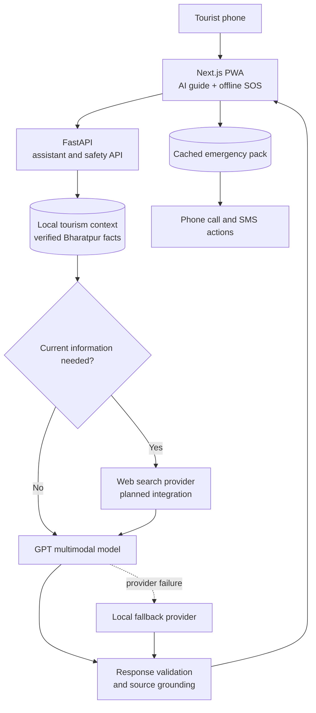
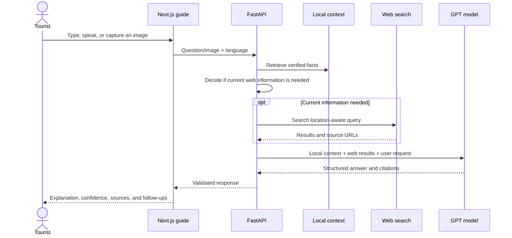
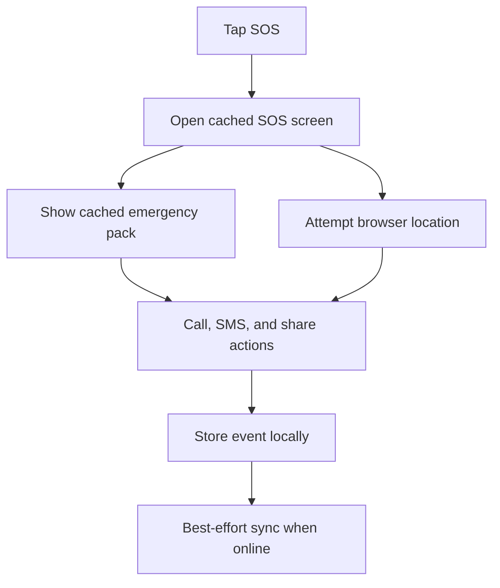

# YatraAI — AI Travel Companion Architecture

## Product description

YatraAI is a multilingual AI travel companion for tourists visiting Bharatpur and the Chitwan region.

Its main feature is an AI guide that helps tourists understand places during their journey. A tourist can ask a question, speak to the assistant, or point the camera at a place or object. YatraAI responds with a concise explanation, practical guidance, confidence, and relevant sources.

The second core feature is offline SOS. It gives tourists access to cached emergency information and phone actions even when mobile internet is unavailable.

> **Ask anything. Show anything. Understand your journey. Stay safe.**

## First prototype scope

### AI guide

- Text questions about tourism.
- Camera questions about landmarks, objects, food, culture, and nature.
- Browser voice input and speech output.
- English, Nepali, and Hindi responses.
- Bharatpur-focused answers using verified local context.
- Selective web search for current information.
- Confidence and source information.
- Cultural significance and historical context are prioritized for place-related questions.
- Local fallback when the model or internet is unavailable.

### Offline SOS

- Cached emergency contacts and instructions.
- Hospital and police information.
- Browser location attempt.
- `tel:` and `sms:` actions.
- Local event storage for later synchronization.
- No dependency on the AI assistant or web search.

### Deferred

- Full itinerary recommendation.
- Booking and payments.
- User accounts and profiles.
- Live tourist tracking.
- Complex agent workflows.
- Vector databases and model fine-tuning.
- Weather, maps, and transport integrations beyond a simple web-search answer.

## High-level architecture



The browser never receives the AI or search API keys. All external AI and web-search calls are made by FastAPI.

## System responsibilities

### Next.js PWA

- Render the home, AI guide, SOS, and settings screens.
- Capture camera images and handle text input.
- Use browser speech recognition and speech synthesis.
- Send assistant requests to FastAPI.
- Display answers, confidence, local sources, web sources, and fallback states.
- Cache the SOS screen and emergency pack with the service worker.
- Store offline SOS events locally.
- Open call and SMS actions through the phone.

### FastAPI

- Validate text, conversation, language, image, and location input.
- Retrieve relevant local tourism context.
- Decide whether current web information is needed.
- Call the GPT provider for text and vision answers.
- Call the web-search provider when current information is needed.
- Combine local context and web results into one prompt.
- Validate the model response and source information.
- Return a safe local answer when an external provider fails.
- Serve emergency data when the application is online.

### Local data

```text
backend/data/
  tourism_context.json  # verified Bharatpur and Chitwan facts
  emergency.json        # emergency contacts and instructions
```

Local context is the source of truth for stable project-specific facts. The team should verify every fact used in the presentation.

## AI guide flow



## Knowledge strategy

The assistant uses two knowledge layers.

### Local context

Use local context for stable landmark explanations, verified cultural and historical summaries, local customs, Bharatpur and Chitwan place names, prepared demo scenarios, and offline fallback answers.

### Web search

Use web search for opening hours, temporary closures, current events, weather, travel conditions, prices, ticket information, transport information, recent tourism notices, and questions that local context cannot answer.

The assistant should not search the web for every question. Searching only when required keeps responses faster, reduces cost, and makes the demo more reliable.

Search queries should include the location where appropriate:

```text
Bharatpur Chitwan Nepal + user's current question
```

The model must distinguish stable local facts from time-sensitive web information and tell the tourist when information may have changed.

For the OpenAI implementation, web search can be added through the Responses API web-search tool. The existing GPT chat and vision provider can remain the first prototype path while web search is introduced behind a separate provider adapter.

## Assistant API

### Current routes

```text
GET  /api/health
POST /api/assistant/chat
POST /api/assistant/analyze-image
```

Frontend-compatible aliases remain available:

```text
POST /api/guide/chat
POST /api/guide/analyze-image
```

### Planned web-search configuration

```env
WEB_SEARCH_ENABLED=true
WEB_SEARCH_MODEL=gpt-5-mini
WEB_SEARCH_CONTEXT_SIZE=medium
```

The search feature is disabled safely when `WEB_SEARCH_ENABLED=false` or the provider is unavailable.

### Chat request

```json
{
  "message": "Is Chitwan National Park open today?",
  "language": "en",
  "conversation": [],
  "context_id": null,
  "latitude": null,
  "longitude": null
}
```

The `question` field is also accepted as an alias for `message` for compatibility with the current frontend.

### Image request

`POST /api/assistant/analyze-image` accepts multipart form data:

- `image`: JPEG, PNG, or WebP image.
- `question`: optional question about the image.
- `language`: `en`, `ne`, or `hi`.
- `context_id`: optional known tourism topic.

### Response

Text and image requests return the same shape:

```json
{
  "title": "Chitwan National Park",
  "summary": "Chitwan National Park is a major nature destination near Bharatpur...",
  "cultural_significance": "The park and its surrounding communities are important to the region's living natural and cultural heritage...",
  "historical_context": "The area became Nepal's first national park in 1973 and has since played a major role in conservation and tourism...",
  "confidence": "high",
  "source_ids": ["chitwan-national-park"],
  "web_sources": [
    {
      "title": "Official visitor information",
      "url": "https://example.com/source",
      "domain": "example.com"
    }
  ],
  "nearby": ["narayani-river"],
  "safety_tip": "Follow current park rules and use an authorized guide.",
  "suggested_questions": ["What should I carry?", "What wildlife might I see?"]
}
```

`web_sources` can initially be hidden from the UI and displayed later in a sources panel. Adding this field does not break the current frontend.

### Assistant rules

- Answer in the requested language.
- Keep answers short and useful for mobile and voice playback.
- When the question is about a specific place, lead with its cultural significance and brief historical context.
- Even for current questions about a place, explain why the place matters before giving current details.
- Use local context for stable Bharatpur claims.
- Use web results for changing information.
- Never invent prices, hours, emergency numbers, or historical facts.
- State uncertainty clearly.
- Return low confidence when evidence is weak.
- Never use the AI model to decide emergency actions.

For a place-related question, the answer order should be:

```text
1. What the place is
2. Why it is culturally significant
3. Brief historical context
4. Current or practical information
5. Safety tip and follow-up question
```

If reliable historical information is not available, the assistant must say so instead of inventing dates or events.

## Offline SOS flow

SOS is an independent safety module. It must open without waiting for FastAPI, GPT, or web search.



Prototype rules:

- Cache the SOS route and emergency data.
- Save the local event before attempting synchronization.
- Do not block call or SMS actions while waiting for location.
- Explain that a browser cannot silently place calls or send messages.
- Use verified Nepal and Bharatpur emergency information.

## Minimal folder structure

```text
yatraai/
  app/
    page.tsx
    scan/page.tsx
    sos/page.tsx
    settings/page.tsx
    lib/api.ts
  backend/
    main.py
    config.py
    schemas.py
    context.py
    provider.py
    service.py
    routes/
      assistant.py
      sos.py                  # next SOS backend slice
    data/
      tourism_context.json
      emergency.json          # next SOS backend slice
  public/
    emergency-pack.json
    sw.js
```

## Delivery order

### Phase 1 — Working AI guide

- Text chat with local context.
- GPT provider and fallback.
- Camera analysis.
- English, Nepali, and Hindi responses.
- Browser voice input and output.

### Phase 2 — Selective web search

- Detect current-information questions.
- Add the web-search provider adapter.
- Combine local context and search results.
- Return web source URLs.
- Test provider failure and offline fallback.

### Phase 3 — Offline SOS

- Verify emergency data.
- Cache the SOS route and emergency pack.
- Add location, call, SMS, and local event storage.
- Test with airplane mode enabled.

### Phase 4 — Presentation polish

- Prepare one text, one voice, and one camera scenario.
- Demonstrate a web-search question.
- Demonstrate SOS with internet disabled.
- Show confidence and source information.

## Definition of done

The prototype is ready when:

1. A tourist can ask a general tourism question and receive a concise answer.
2. A tourist can use the camera and receive an explanation with confidence.
3. A tourist can ask by voice and hear the answer.
4. The assistant responds in English, Nepali, and Hindi for prepared examples.
5. A current-information question can use web search and show sources.
6. Web-search or GPT failure produces a friendly local fallback.
7. SOS opens in airplane mode with cached emergency information.
8. Call and prepared SMS actions remain available offline.

## Future expansion

After the prototype is stable, YatraAI can add itinerary planning, personalized recommendations, live maps, weather APIs, transport data, user preferences, downloadable offline knowledge packs, local business integrations, and municipal tourism analytics without changing the core product identity.
